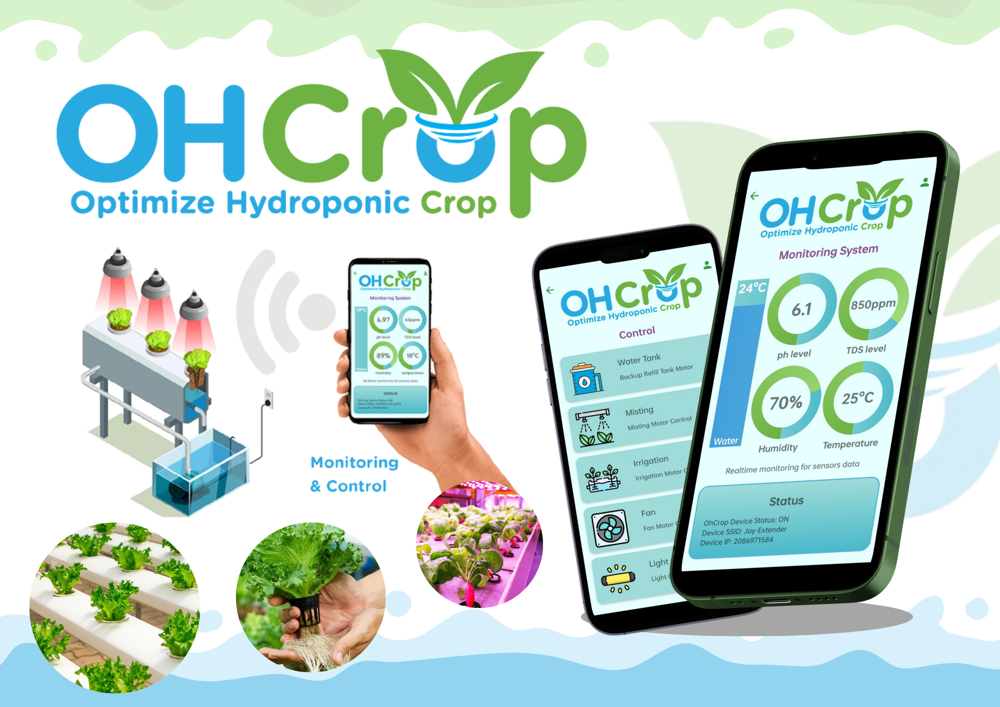
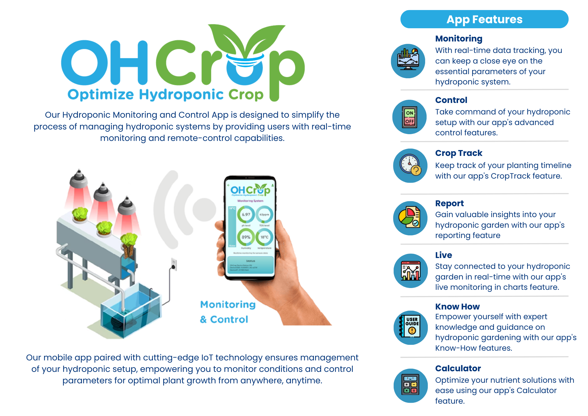
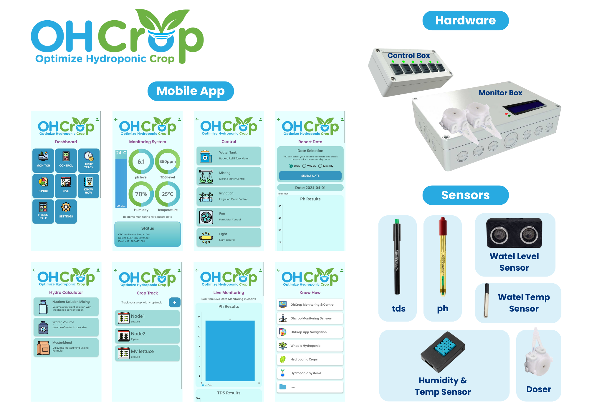

# OHCrop

 Our Hydroponic Monitoring and Control App is designed to simplify the process of managing hydroponic systems by providing users with real-time monitoring and remote-control capabilities.
- Capstone Project

**Email**: [Facebook](https://www.facebook.com/OptimizeHydroponicCrop)

## Contents

- **Mobile Features**: Monitoring, Control, Crop Track, Report, Live, Know How, Calculator
- **Hardware Features**: Arduino R3, ESP32, Sensors (humidity and temp, tds, ph, water level, proximity)

## Tech Stack

- **Kotlin**: The mobile application is built in Android using Kotlin
- **C++**: The IOT is programmed using C++ using Arduino
- **Firebase**: Storage and realtime data

## Contact

For questions or feedback, feel free to reach out:

- **Email**: [MAIL](mailto:jayjucarjr@gmail.com)
- **GitHub**: [LINK](https://github.com/JayThreeme)

---
